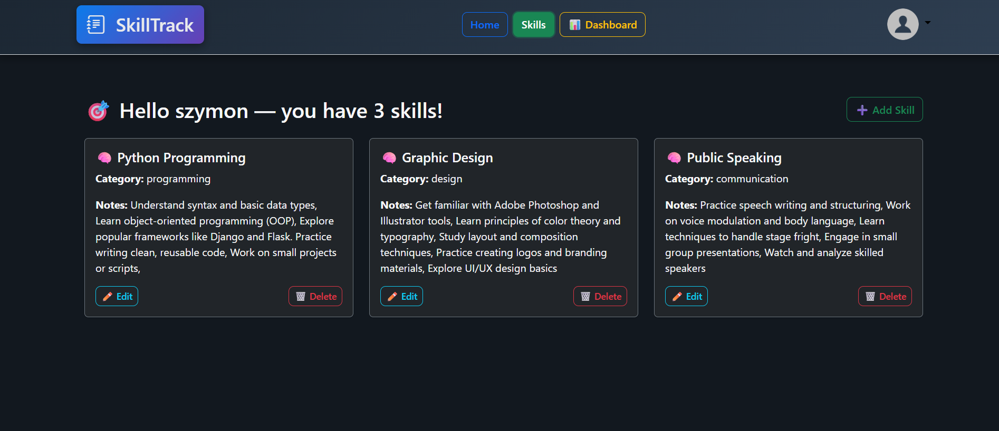

# 🧠 SkillTrack

**SkillTrack** is a full-stack web application built with Django. It helps users track their learning process by managing skills and study sessions. The app includes a user-friendly web interface and a secure REST API using JWT.

---

## 🧩 Features

### 🌐 Web Interface

- Public home page showing recent study sessions (with limited view for anonymous users)
- User registration, login, and logout
- User profile view and edit (including profile picture upload and removal)
- Dashboard page with statistics and charts:
  - Total number of study sessions
  - Total study time (sum of durations)
  - Average session duration (minutes)
  - Breakdown of sessions by skill category (top 3)
  - Daily study time chart
  - Display last study session details
- CRUD operations for Skills:
  - Add new skill
  - View all skills
  - Edit skill details
  - Delete skills
- CRUD operations for Study Sessions:
  - Add new study session (linked to a skill)
  - Edit study session
  - Delete study session

### 🔌 REST API (JWT protected)

- `POST /api/register/` – Register a new user account
- `POST /api/token/` – Obtain JWT access and refresh tokens
- `POST /api/token/refresh/` – Refresh access token using refresh token

- `GET /api/skills` – List all skills for authenticated user
- `POST /api/skills` – Create a new skill
- `GET /api/skills/<id>` – Retrieve details of a specific skill
- `PUT /api/skills/<id>` – Update a specific skill
- `DELETE /api/skills/<id>` – Delete a specific skill

- `GET /api/sessions` – List all study sessions for authenticated user
- `POST /api/sessions` – Create a new study session
- `GET /api/sessions/<id>` – Retrieve details of a specific session
- `PUT /api/sessions/<id>` – Update a specific session
- `DELETE /api/sessions/<id>` – Delete a specific session

---

## 🛠️ Tech Stack

- **Python 3.x** — the main programming language used for the application.
- **Django** — web framework for building web views (Class-Based Views), routing, authentication, and templating.
- **Django REST Framework (DRF)** — used to create the REST API with `APIView` classes and serializers.
- **JWT (SimpleJWT)** — token-based authentication mechanism for securing the API with JSON Web Tokens.
- **Django Forms** — handling forms in the web interface (e.g., adding/editing skills and study sessions).
- **LoginRequiredMixin** — a mixin that restricts access to certain views to authenticated users only.
- **Django Generic Views (CreateView, LoginView, etc.)** — simplifying common CRUD operations and user authentication.
- **Django ORM** — database interaction and model management for `Skill`, `StudySession`, and `UserProfile`.
- **Chart.js (frontend)** — for visualizing statistics and charts on the dashboard (e.g., session duration, skill categories).
- **HTML, CSS, JavaScript** — standard frontend technologies used for building the user interface.

### 🚢 Containerization & Production

- **Docker & Docker Compose** — containerize the application and its services (Django app, PostgreSQL database) for easy setup and consistent environments across development and production.
- **Gunicorn** — a production-ready WSGI HTTP server used to serve the Django application efficiently, handling multiple requests concurrently.
- **python-dotenv** — loads environment variables from a `.env` file, helping keep sensitive data like secret keys and database credentials out of source code.
- **Pillow** — Python Imaging Library used for handling image uploads (e.g., user profile pictures).

---

## 🐳 Getting Started - *with docker* 
Follow these steps to set up and run SkillTrack locally:

1. **Clone the repository** 
    ```bash 
   git clone https://github.com/LuckyS-J/SkillTrack.git

2. **Navigate to the backend directory** 
    ```bash
   - cd skilltrack/backend

3. **Create a `.env` file**  
   In the backend directory, create a file named .env and add the following environment variables. Replace the placeholder values with your own settings:

   - **SECRET_KEY**=your_secret_key_here
   - **DEBUG**=True
   - **ENGINE**=django.db.backends.postgresql
   - **NAME**=SkillTrack
   - **USER**=db_user
   - **PASSWORD**=your_password
   - **HOST**=db
   - **PORT**=5432
   - **POSTGRES_USER**=db_user
   - **POSTGRES_PASSWORD**=your_password
   - **POSTGRES_DB**=SkillTrack
   

4. **Build Docker containers**
    ```bash
   - docker-compose build
   
6. **Start containers in detached mode**
    ```bash
   - docker-compose up -d
   
7. **Apply database migrations**
    ```bash
   - docker-compose exec web python manage.py migrate

---

## 🐍 Getting Started - *with PGSQL & python* (only debug server)
Follow these steps to set up and run SkillTrack locally:

1. **Clone the repository**  
    ```bash
   git clone https://github.com/LuckyS-J/SkillTrack.git

2. **Navigate to the backend directory**  
    ```bash
   cd skilltrack/backend

3. **Create a `.env` file**  
   In the backend directory, create a file named .env and add the following environment variables. Replace the placeholder values with your own settings:

   - **SECRET_KEY**=your_secret_key_here
   - **DEBUG**=True
   - **ENGINE**=django.db.backends.postgresql
   - **NAME**=SkillTrack
   - **USER**=db_user
   - **PASSWORD**=your_password
   - **HOST**=localhost
   - **PORT**=5432

4. **Create a `.venv` file**  
    ```bash
   python -m venv .venv

5. **Active `.venv`**  
    ```bash
   .venv\Scripts\activate

5. **Install requirements**  
    ```bash
   pip install -r requirements.txt

6. **Run migrations**
    ```bash
   python manage.py migrate
   
7. **Start app**
    ```bash
   python manage.py runserver
   
---

### Accessing the application

- Open your browser and go to `http://localhost:8000/` for the web interface.
- To register a new user, use the registration form at `/accounts/register/`.
- To login, use `/accounts/login/`.
- Access the dashboard at `/dashboard/` after logging in.
- Manage skills at `/skills/`, add new skills at `/skills/add/`.
- Manage study sessions on the home page or add new sessions at `/sessions/add/`.
- Edit your user profile at `/edit-profile/`.

---
  
### Using the API

Use a tool like Postman or curl to interact with the API:

- Register user: `POST /api/register/` with JSON payload `{ "username": "...", "password": "..." }`
- Obtain JWT token: `POST /api/token/` with `{ "username": "...", "password": "..." }`
- Use the access token in `Authorization: Bearer <token>` header to call protected endpoints such as `/api/skills`, `/api/sessions`, etc.

## Screenshots

### Dashboard


### Profile


### Sessions


### Skills



